# Arquitectura

Diagramas [C4](https://c4model.com/) de nutrikit, escritos como código en [Mermaid](https://mermaid.js.org/).

| Nivel | Fuente | Imagen |
| --- | --- | --- |
| 1 · Contexto | [`c4-nivel-1-contexto.mmd`](c4-nivel-1-contexto.mmd) | [SVG](c4-nivel-1-contexto.svg) · [PNG](c4-nivel-1-contexto.png) |
| 2 · Contenedores | [`c4-nivel-2-contenedores.mmd`](c4-nivel-2-contenedores.mmd) | [SVG](c4-nivel-2-contenedores.svg) · [PNG](c4-nivel-2-contenedores.png) |

El nivel 3 (componentes) lo genera Spring Modulith a partir del código: `./mvnw verify` deja los diagramas de módulos en `backend/target/spring-modulith-docs`.

## Nivel 1 · Contexto



## Nivel 2 · Contenedores



## Notación

Los diagramas usan la notación C4 (persona, sistema, contenedor, sistema externo y límite del sistema) sobre `flowchart` de Mermaid, no la sintaxis `C4Context`/`C4Container`. Esa sintaxis es experimental en Mermaid y, con cuatro personas y tres sistemas externos, apila todo en una columna con flechas encimadas. Cada caja indica su tipo y tecnología entre corchetes, y cada relación indica su protocolo.

El nivel 2 usa el layout ELK. El render nativo de Mermaid en GitHub puede no aplicarlo, así que el README enlaza las imágenes exportadas en lugar de bloques ` ```mermaid `.

## Regenerar las imágenes

Requiere Node 18 o superior.

```bash
cd docs/architecture
for f in c4-nivel-1-contexto c4-nivel-2-contenedores; do
  npx -y @mermaid-js/mermaid-cli -i $f.mmd -o $f.svg -b white
  npx -y @mermaid-js/mermaid-cli -i $f.mmd -o $f.png -b white -s 2
done
```

Si cambias un `.mmd`, regenera y sube las imágenes en el mismo commit.
